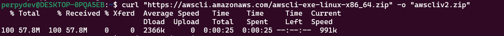
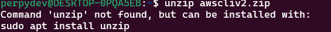
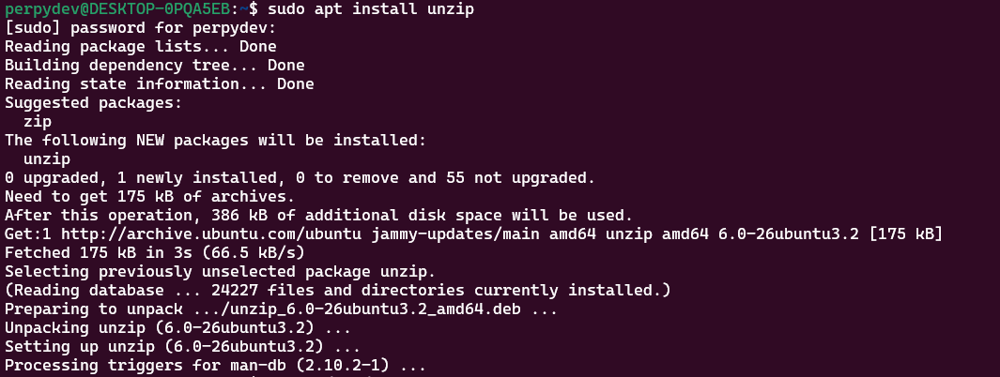
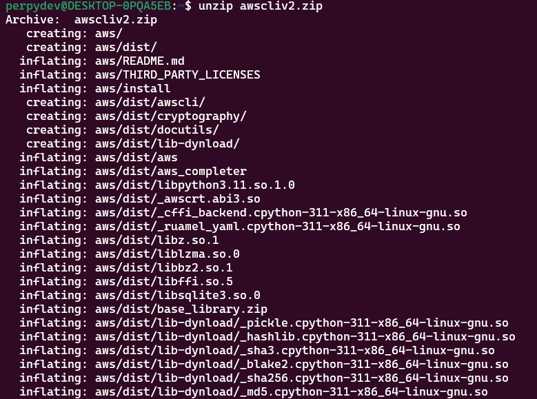
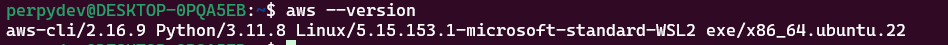
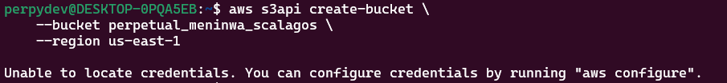
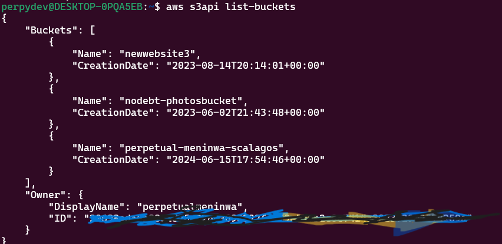

# Create AWS s3 BUCKET USING THE AWS CLI

## Overview
This is a simple project on how to create an AWS s3 bucket using the AWS CLI.

## Prerequisites

Before setting up the codebase, make sure you have the following prerequisites;

- [AWS Account setup](https://console.aws.amazon.com/console/home)
- [AWS User setup](https://console.aws.amazon.com/console/) - with User access key and secret access key

## Configuration

- Depending on the operating system you use, [install the AWS CLI](https://docs.aws.amazon.com/cli/latest/userguide/getting-started-install.html). For more clarification, I used the Linux operating system to install and configure the AWS CLI.

```bash
    $ curl "https://awscli.amazonaws.com/awscli-exe-linux-x86_64.zip" -o "awscliv2.zip"
```


- Unzip the installation folder

```bash
    unzip awscliv2.zip
```
For this to work, you need to you need to have **unzip** installed `bash sudo apt install unzip`






- After unzipping, install using the command below:
```bash
    sudo ./aws/install
```


- Confirm that **aws cli** has been successfully installed
```bash
    aws --version
```


- After successfully installing, you also need to configure the credentials of the user before creating a bucket. You will get an error if you try creating without configuring the credentials.


Ensure you have the access key and secret access key stored and ready to be used.
To configure the credentials;
```bash
    aws configure
```

Input the **Access Key**
Input the **Secret Access Key**
Input the **s3 Region**
Input any other options (if none, leave blank).

## Create an s3 Bucket
- ### Using Bash Script

- Clone the repository

```bash
    git clone https://github.com/Perpy-del/sca_cloud_ass.git
```

- cd sca_cloud_ass

- Create a .env file

- Copy the variable names from the **.env.example** file, and replace the values with the right values

- Make the bash script in the **create_s3_bucket.sh** file executable

```bash
    chmod +x create_s3_bucket.sh
```

- Run the bash script

```bash
    ./create_s3_bucket.sh
```

- ### Alternatively, you can use the CLI with this command:

```bash
    aws s3api create-bucket \
    --bucket my-bucket \
    --region us-east-1
```

_**my-bucket**_ in this instance is the name of the bucket created.

To confirm if the bucket was created successfully, you can list the buckets available using this command;

```bash
    aws s3api list-buckets
```



_**Thank you for reading**_

