# Create AWS s3 BUCKET USING THE AWS CLI

## Overview
This is a simple project on how to create an AWS s3 bucket using the AWS CLI.

## Prerequisites

Before setting up the codebase, make sure you have the following prerequisites;

- [AWS Account setup](https://console.aws.amazon.com/console/home)
- [AWS User setup](https://console.aws.amazon.com/console/) - with User access key and secret access key

## Configuration

- Depending on the operating system you use, [install the AWS CLI](https://docs.aws.amazon.com/cli/latest/userguide/getting-started-install.html). For more clarification, I used the Linux operating system to install and configure the AWS CLI.

```bash
    $ curl "https://awscli.amazonaws.com/awscli-exe-linux-x86_64.zip" -o "awscliv2.zip"
```


- Unzip the installation folder

```bash
    unzip awscliv2.zip
```
For this to work, you need to you need to have **unzip** installed `bash sudo apt install unzip`


- After unzipping, install using the command below:
```bash
    sudo ./aws/install
```


- Confirm that **aws cli** has been successfully installed
```bash
    aws --version
```


- After successfully installing, you also need to configure the credentials of the user before creating a bucket. You will get an error if you try creating without configuring the credentials.


Ensure you have the access key and secret access key stored and ready to be used.
To configure the credentials;
```bash
    aws configure
```
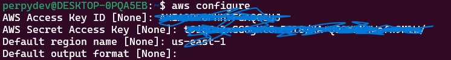
Input the **Access Key**
Input the **Secret Access Key**
Input the **s3 Region**
Input any other options (if none, leave blank).

## Create an s3 Bucket
- ### Using Bash Script

- Clone the repository

```bash
    git clone https://github.com/Perpy-del/sca_cloud_ass.git
```

- cd sca_cloud_ass

- Create a .env file

- Copy the variable names from the **.env.example** file, and replace the values with the right values

- Make the bash script in the **create_s3_bucket.sh** file executable

```bash
    chmod +x create_s3_bucket.sh
```

- Run the bash script

```bash
    ./create_s3_bucket.sh
```

- ### Alternatively, you can use the CLI with this command:

```bash
    aws s3api create-bucket \
    --bucket my-bucket \
    --region us-east-1
```

_**my-bucket**_ in this instance is the name of the bucket created.

To confirm if the bucket was created successfully, you can list the buckets available using this command;

```bash
    aws s3api list-buckets
```


## Create an IAM user with the policy access to read s3 buckets only
- Log into your AWS management console (ensure you have admin access)

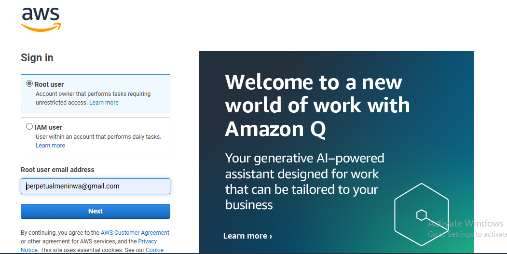

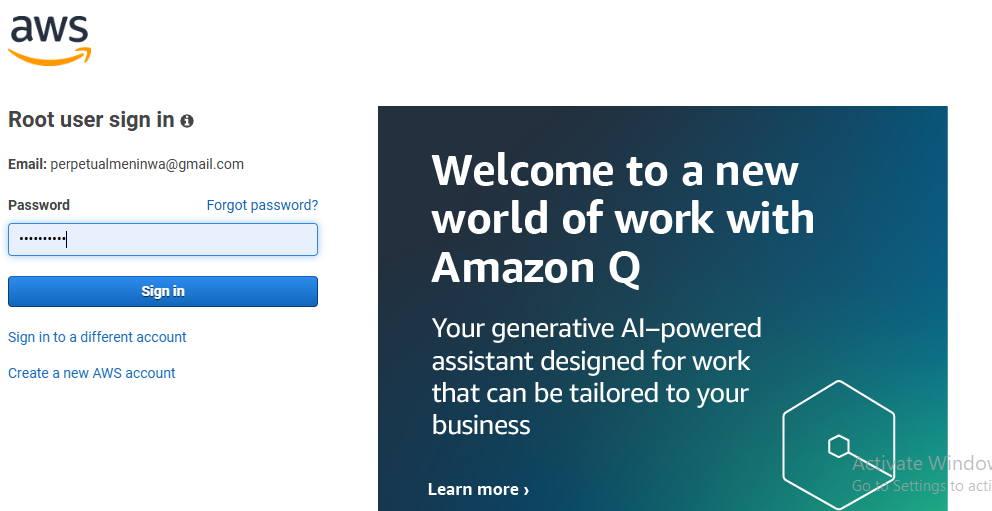

- Search for IAM using the search bar

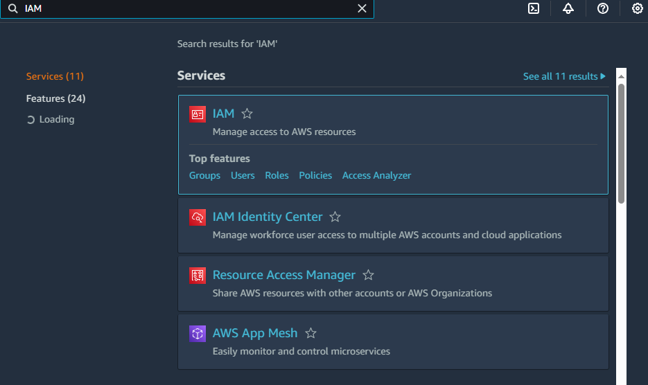

- From the sidebar, search for Users and click on it, then click on Create User
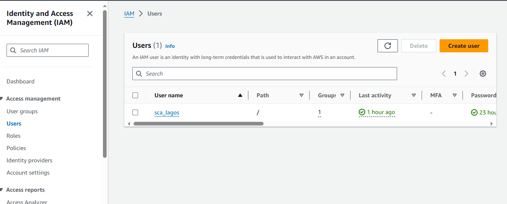

- Give the user a name, then select the Provide user access to the AWS Management Console, select the _I want to create an IAM user_ and deselect the _User must create a new password on Sign In_, then click on the **Next** button
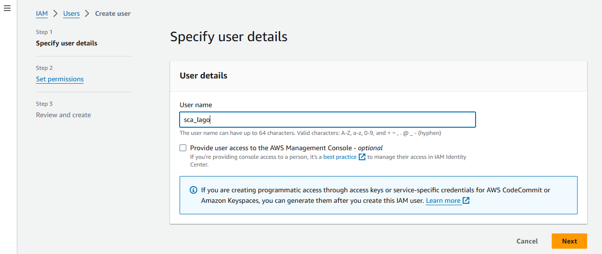

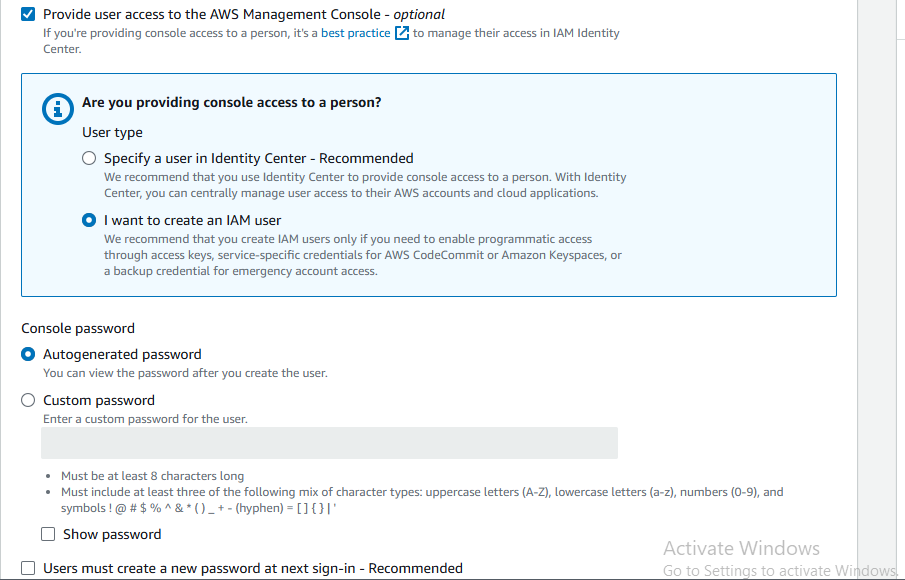

- Set permission, the best option is to add user to a user group
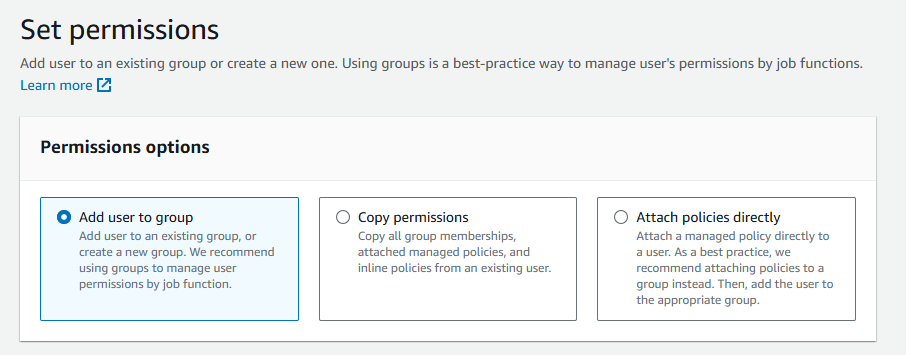
You can create a user group if one has not been created by Clicking on **Create group** or selecting **User group** on the side bar.
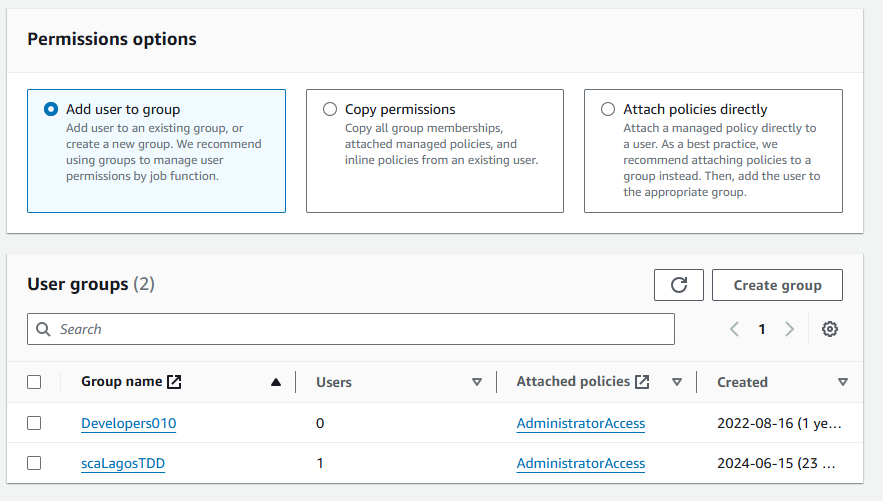

- Give the user group a name and add a policy manually by clicking on **Create policy** or selecting from the list of policies outlined, then click on **Create user group**
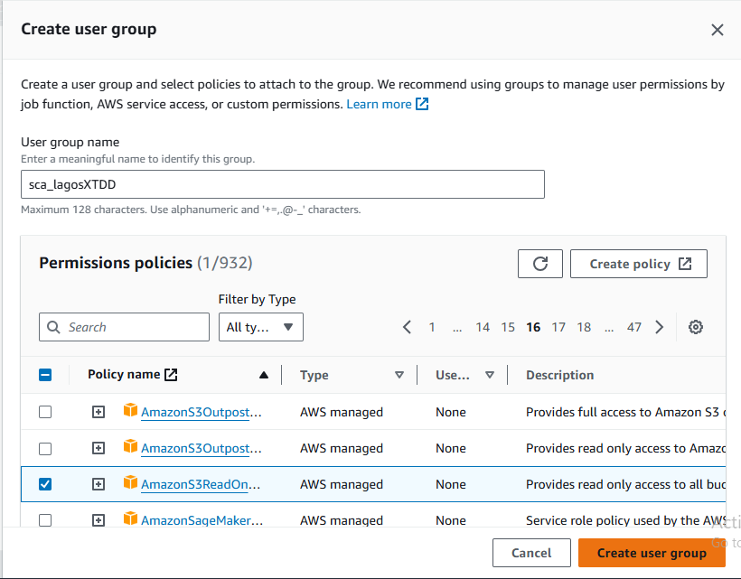

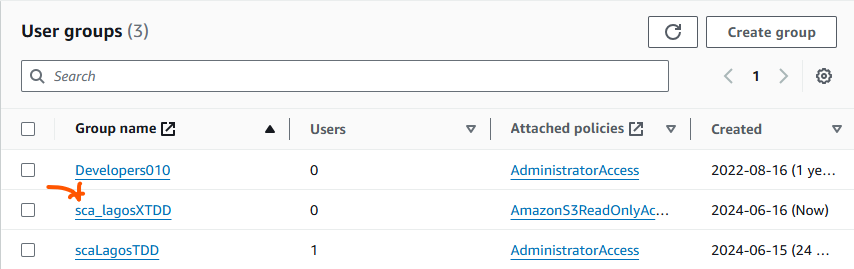

- Review changes and click on **Create user**
- Once the user has been created successfully, copy the user details and store somewhere.

- You can create access key for the user by clicking on the user and clicking on **Create access key**
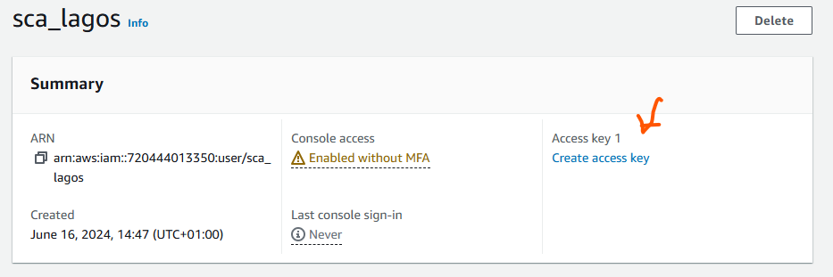

- Select the use case for the Access key, select the _I understand the above recommendation and want to proceed to create an access key_, then click Next
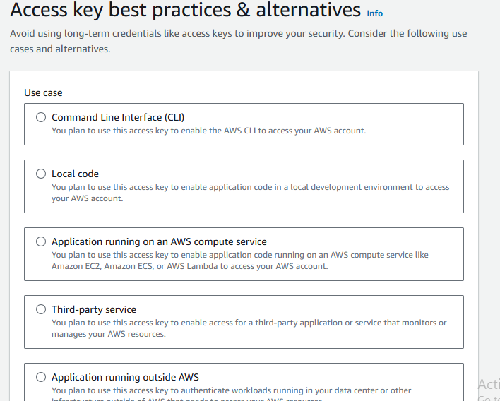
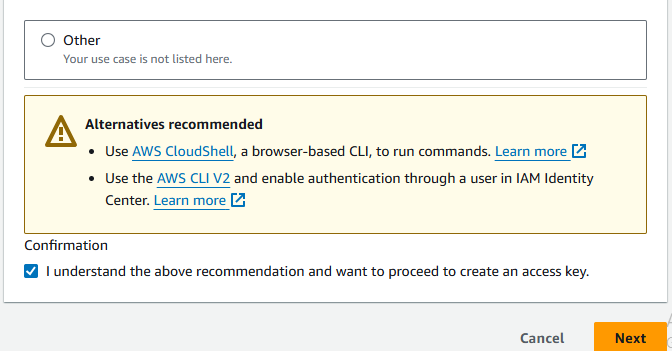

- You can also give it a tag, but it is entirely optional
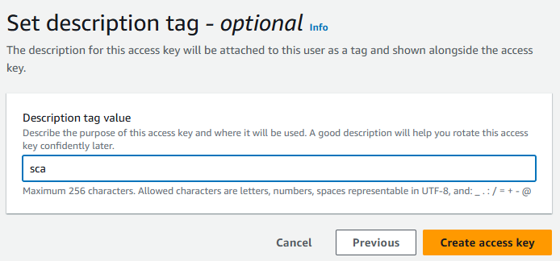

- Ensure to copy the access key and secret access key as soon as the key has been created successfully


- Now you can see the user details including the fact that the user has access keys for a specific policy.
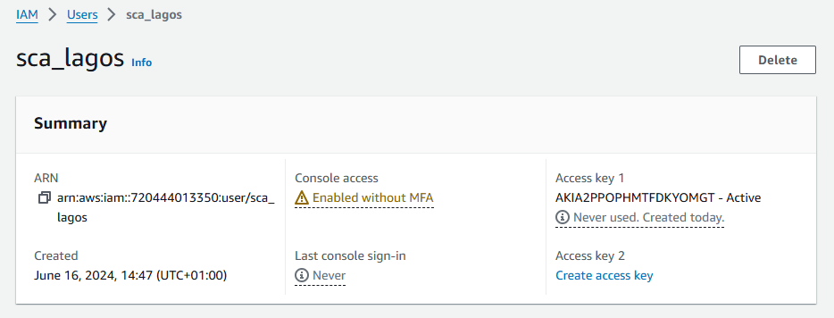


_**Thank you for reading**_

